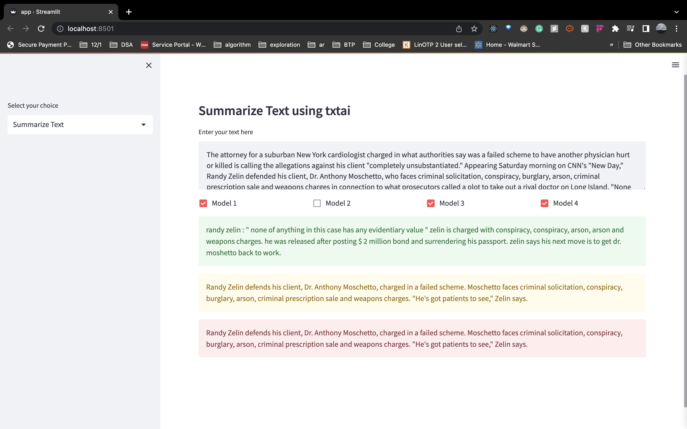

# Abstractive Text Summarization Web-App

Abstractive summarization is the process of generating a summary of a text by understanding its meaning and creating a new text that conveys the same information in a shorter form. Abstractive methods employ more powerful natural language processing techniques to interpret text and generate new summary text, as opposed to selecting the most representative existing excerpts to perform the summarization. 
<a href="#Documentations">Read More</a>
The app has a comparison of 4 deep learning NLP models trained and fine tuned on the cnn_dailymail dataset to summarize
<a href="#Documentations">Read More</a>

 

My Streamlit app allows us to process both raw text and PDF files to get a summary.

# Pre-requisites
* [x] Any IDE
* [x] streamlit `pip install streamlit`

# Run the App
- Clone the repository 
- Install the dependencies
- Execute `streamlit run app.py`

# Sample Input:
Gmail will soon have a feature that will write entire emails for you using AI, Google announced on Wednesday at its Google I/O event.

The feature, dubbed "help me write," is basically an expansion of the auto-replies and generative text that Google already uses in Gmail. While announcing the feature, Sundar Pichai, CEO of Google, used an example of asking an airline for a refund for a flight. The AI feature pulls info from previous exchanges with the airline and creates an entire message asking for the refund. You can then edit that message to your liking and send it away.

# Sample Output

# Documentations

* <a href="https://docs.streamlit.io/">Streamlit</a>
# news-summarizer-comparison
